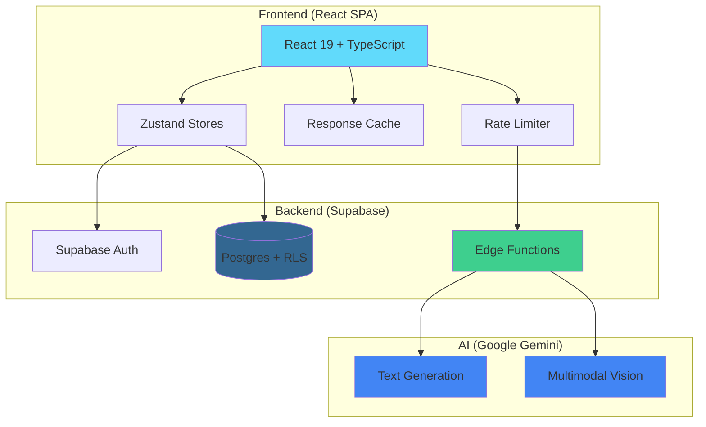

# 🍳 PantryCheff

> Cook from what you already have — AI-powered pantry tracking,
> recipe matching, and personalized recipe generation.

[](https://github.com/Gurehmat/PANTRYCHEFFV3/actions/workflows/ci.yml)

[Live Demo](https://gurehmat.github.io/PANTRYCHEFFV3/) |
[Architecture](#architecture) | [Getting Started](#getting-started)

## ✨ Features

List every feature with emoji icons, grouped logically:

**Core**
- 🗄️ Pantry Management — add, edit, delete items with quantities,
  units, and expiry dates
- 📸 AI Fridge Scanner — photograph your fridge/pantry and let
  Google Gemini identify ingredients automatically
- 📖 Recipe Browser — browse curated recipes matched against your
  pantry items
- ❤️ Favorites — save recipes you love
- 🛒 Shopping List — track missing ingredients you need to buy

**AI-Powered**
- 🪄 Magic Recipe Generation — AI generates personalized recipes
  from your current pantry items
- 🔄 Smart Substitutions — AI suggests ingredient substitutions
  for missing items
- 📊 Confidence-Based Matching — algorithm scores recipe matches
  with exact, partial, and fuzzy matching

**User Experience**
- 👨‍🍳 Cook Mode — distraction-free step-by-step cooking interface
  with ingredient checklist
- ⚠️ Expiry Alerts — color-coded warnings for expired and
  soon-to-expire pantry items
- 📈 Dashboard Stats — at-a-glance view of pantry status and
  makeable recipes
- ⚡ Response Caching — AI responses cached to reduce API calls
  and improve speed
- 🛡️ Rate Limiting — client-side protection against API abuse

**Engineering**
- 🔒 Row-Level Security — database-level data isolation per user
- 🧪 154 automated tests with Vitest
- 📝 Full TypeScript (strict mode)
- 🔄 CI/CD pipeline with GitHub Actions
- 🎨 Consistent code style via ESLint + Prettier + Husky

## 📸 Screenshots

(Add HTML comment placeholders for where to insert screenshots later:)
<!-- Screenshot: Landing Page -->
<!-- Screenshot: Dashboard with Stats and Expiry Alerts -->
<!-- Screenshot: Pantry with items -->
<!-- Screenshot: AI Recipe Generation -->
<!-- Screenshot: Cook Mode -->
<!-- Screenshot: Fridge Scanner -->

## 🏗️ Architecture

Add a Mermaid diagram:



## Getting Started

### Prerequisites

- Node.js (LTS)
- A [Supabase](https://supabase.com) project
- A [Gemini API key](https://ai.google.dev/) (configured as a secret in Supabase Edge Functions)

### 1. Clone and install

```bash
git clone https://github.com/YOUR_GITHUB_USERNAME/PANTRYCHEFFV3.git
cd PANTRYCHEFFV3
npm install
```

### 2. Environment variables

Create a `.env` file in the project root:

```env
VITE_SUPABASE_URL=your_supabase_project_url
VITE_SUPABASE_ANON_KEY=your_supabase_anon_key
```

In the Supabase Dashboard, set the `GEMINI_API_KEY` secret for Edge Functions, then deploy the functions.

### 3. Supabase setup

- Apply the SQL in `supabase/migrations/` (e.g. via the Supabase SQL editor or CLI).
- In **Authentication → URL Configuration**, set **Site URL** and **Redirect URLs** to match your app (e.g. GitHub Pages base URL and `http://localhost:5173` for local dev).

### 4. Run locally

```bash
npm run dev
```

Open the URL shown in the terminal (typically `http://localhost:5173`).

### 5. Build and deploy

```bash
npm run build
npm run deploy
```

The app is configured for GitHub Pages; `deploy` publishes the `dist` folder to the `gh-pages` branch.
